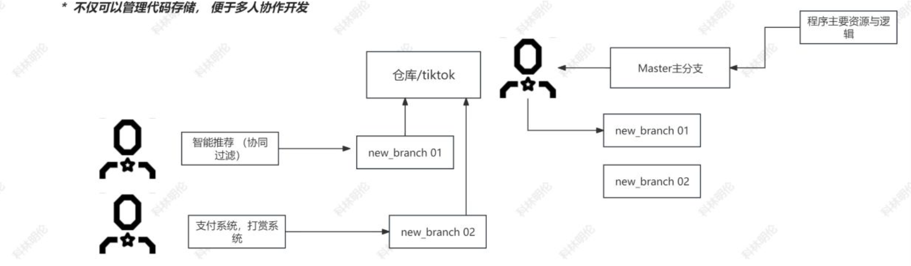
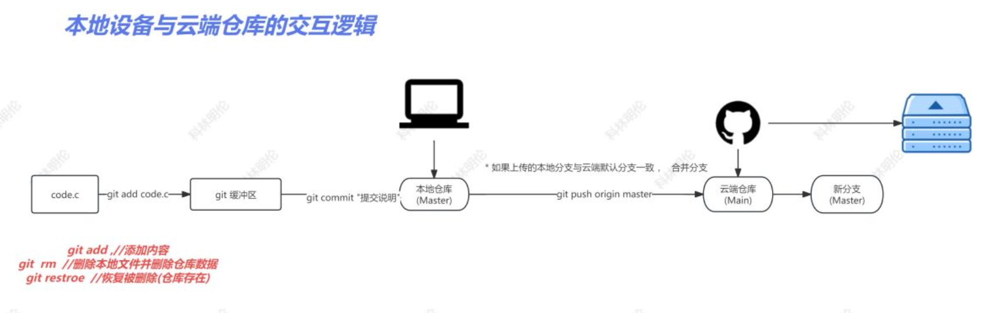

# Github
---
## 关键字查询：
### python awesome:
    查询此标签下的python项目
### python tutorial: 
    查询python资料、书籍、文档
### socket sample:
    查询socket 的代码样例
---
## Github 三要素：
### Repository 仓库：
    GitHub项目管理的基本存储单位，一个仓库中存储一个项目，一个用户中可以拥有多个仓库，仓库分为public、private
### commit 提交
    程序员在整个开发周期，有大量的对代码资源的迭代和修改，都可以通过commit进行记录，便于程序员回溯代码，即使代码被删除。提交便于使用者观察整个工程的开发流程以及设计流程
### branch 分支
    在仓库中可以包含多个分支，分支才是代码文件的第一存储单位，默认的仓库主分支为master/main，方便协作开发 <br>

<p align="center">

</p>

---
## 仓库内容
### code
    资源存储，代码，二进制，项目管理脚本，许可证
### issues
    一个类似贴吧的平台，用来讨论项目运行时遇到的问题
### README
    使用markdown语言编写，工程自述文件，开发进度，版本更新，使用介绍等等
### LICENSE许可证
    GPL2.0，Apahce 2.0,Mit,这些许可证，给使用者最大的权限，以及最小的限制
---
## Git 软件，分布式版本控制系统
  1. 绑定设备，方便管理代码
```bash
   git init //创建本地仓库
   git config -list //查看git 配置文件
  ```
  2. 修改或添加config配置项
```bash
   git config --global user.name
   git config --global user.email
```
  3. 生成本机设备密文
```bash
   ssh-keygen -t rsa -C "注册邮箱"
```
  4. 测试关联是否完成
```bash
   ssh -T git@github.com  
```
  5. 为目标仓库起别名，定位目标仓库，后续上传
```bash
   git remote add origin（别名） 云端仓库地址
   git remote remove origin //删除别名
```
---

<P>

</p>

---
```bash
   git add code.c #把文件添加到缓冲区
   git commit -m "记录说明"  #提交到本地仓库 并 生成提交记录
   git push origin master #将本地文件同步到云端
   git status  #查看状态
   git rm code.c #删除本地文件及仓库文件
   git restore code.c #恢复文件
```
---
## 	代码更新的依赖关系被破坏 

本地内容比云端新，完成更新替换，但是如果直接修改云端内容，导致本地内容无法再次提交

```
//先拉取git pull 云端内容 与本地内容合并或操作，而后再次推即可
```

```
git pull --rebase origin master 
```

```
git rebse --skip  //保留云端内容
```

```
git rebase --abort //保留本地内容
```

```
git rebase --continue //合并？？
```

下载开源代码

```
git clone "HTTP仓库地址" //下载开源项目code 资源
```
## 分支

    创建分支、选择分支、合并分支
---
**第二节的内容见文件** [class2.md](./class2.md "点击跳转")
---
